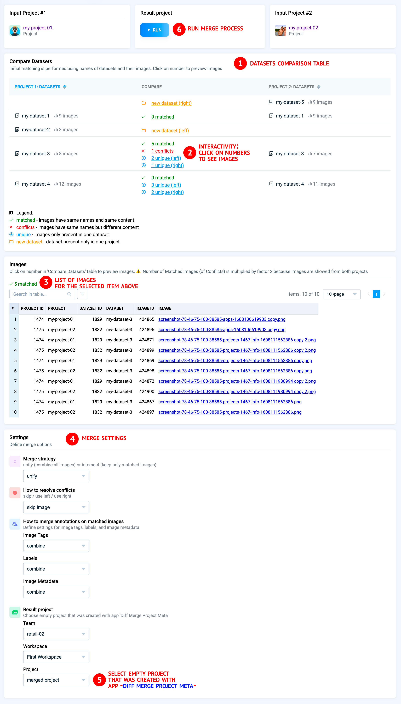
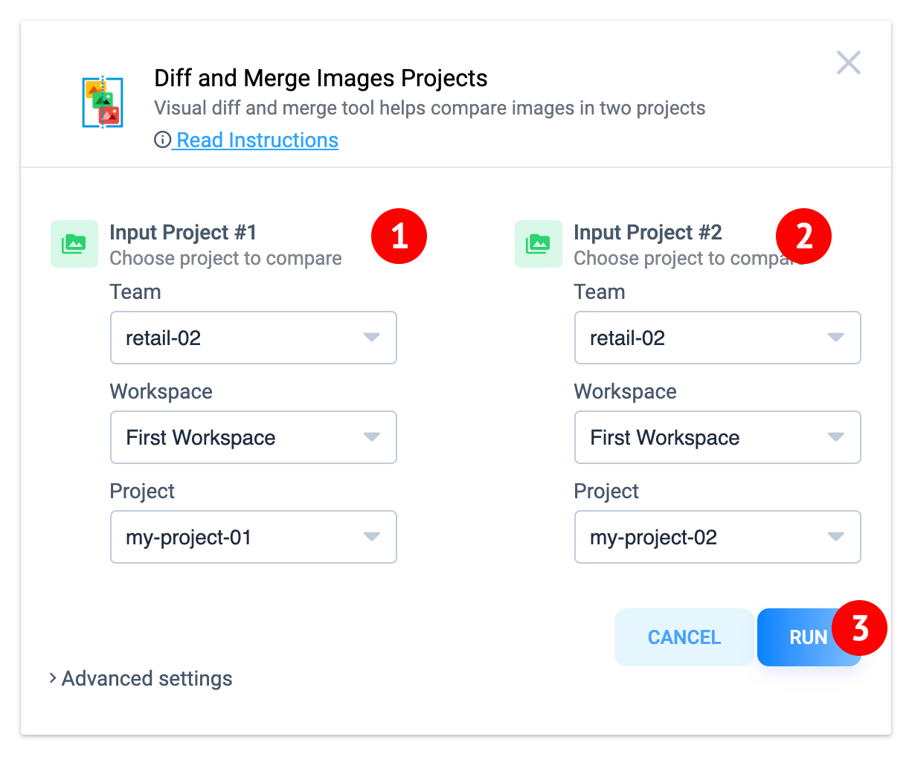

# Diff Merge Two Images Projects

  <a href="#Overview">Overview</a> •
  <a href="#How-To-Use">How To Use</a>

## Overview

Visually compare and merge two images projects: datasets / images / image tags / labels / image metadata. Define how to merge them and how to resolve conflicts. 

## How To Use

**Step 1:** Add app to your team from Ecosystem if it is not there

**Step 2:** Please, firstly use [`Diff Merge Project Meta`](https://ecosystem.supervise.ly/apps/diff-merge-project-meta) app to merge project metas: classes and tags. As a result empty project with merged classes and tags will be created. This project should be used as a result project for current application. 

**Step 2:** Run app from the `Apps` page of current team. Choose two projects to compare and merge

**Step 3:** Explore comparison table, define merge options and press `Run` button.

**Step 4:** See warnings and errors in app's logs

**Step 5:** Task is created in `Application Sessions`. 
